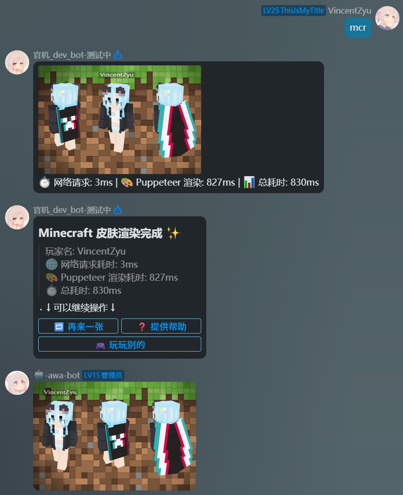
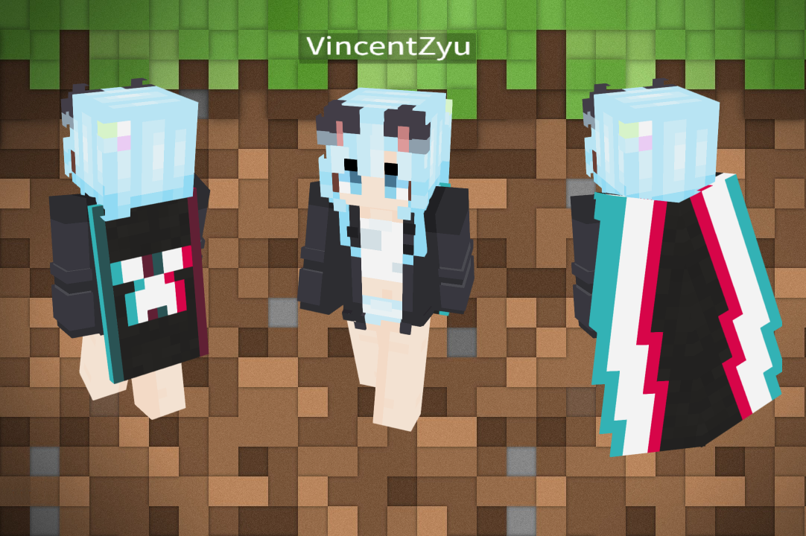

# koishi-plugin-mcrenderskin-vincentzyu-fork

[](https://www.npmjs.com/package/koishi-plugin-mcrenderskin-vincentzyu-fork)
[](https://www.npmjs.com/package/koishi-plugin-mcrenderskin-vincentzyu-fork)

[](https://github.com/VincentZyuApps/koishi-plugin-mcrenderskin-vincentzyu-fork)
[](https://gitee.com/vincent-zyu/koishi-plugin-mcrenderskin-vincentzyu-fork)

[](https://forum.koishi.xyz/t/topic/12622)
[](https://qm.qq.com/q/4vjto4V7Di)

## 🙏 特别感谢

本插件基于 upstream 项目 [koishi-plugin-mcrenderskin-custplugin](https://www.npmjs.com/package/koishi-plugin-mcrenderskin-custplugin) 进行二次开发与功能增强。感谢上游作者的开源贡献。

[![Koishi](https://img.shields.io/badge/Koishi-plugin-5546A3?style=flat-square&logo=data%3Aimage%2Fpng%3Bbase64%2CiVBORw0KGgoAAAANSUhEUgAAADIAAAAyCAYAAAAeP4ixAAAFBUlEQVR42s2aT2gdVRTGf2eSaLEqhopSmz7FIhVjs6hKpMGFWhSiAbFYNwW3YsGdLiyKFeKiurALEXQh%2BA8DGroQLKjZWJBIKTQ1iFHbEmtjTGlIbGqa5M3n5ly5TGdemvS9l7nwePNm5s1835w%2F98z5rrGKISkBzMyq0b4K8KB%2F7gUqQDuwzk%2BZB6aBceAnYBgYNrPT0TVaAJlZSiOHJPObhd%2B3SXpB0jeSprXyMSPpO0kvSuqICUmyRpGICdwt6b0c8FVJS%2F6dFnzic7KkPpDUmXfPupKQ1C7pbUkXIwCLDixdhUVS%2F%2B9itG9e0juSNtSNjLtS4tu9kn7PEFgN%2BFqkYkKnJPWFmFy1qzkJ8%2B39DSSwHKH%2BLJ4Vk5DUKumTyP%2Brat4IsSRJn0tqWxGZ4E5O4pBfaEFrN8K9v3Iyy7tZsIJvf1oCElkyA46ttSaZiMT%2BEpHIkumPsdZKsY81KaivJgn0ZlNzyErm2zcAJ4AOQEBCuUbqOM8C24AZL2kUgCZe37wGbAaqJSSBY6oCm4DXHXMCECY8AVu8mGtz1kY5h%2FyzBHQBY4CFKlbAS8C1kfnKSsIc4zXAy47dQozcCvwGrI9jp8RD%2Fn0RuMvMJkIc7AKud%2F%2BzEgM%2FCcw5xqo%2F%2BGeIAnpXZLYyjvCi9Rnwh5MIBJ8GSCRtBh5wEklJiQRcR4GbgBbfZ8D9kioJ0OPzR1pitzLgHDACHAM%2BBBb82HpgRwJ0Z%2FywjG4l4JiZnTKzJ4BJz7CLfk53K9BZ8kwVLPKRpO1ujS7fH%2BqtzsS7HZTYrVo9zQ4Ce5zEQmbSriTesinrCNnpSzP7F9jprpZ9j283STPAjSVNv6GWusetcjJjiYB5Nim5NRLgazP7GXjOgVfzTjZJk8AtJbOIoulgO%2FAr8KfPIdXItQLmvxNvY5bRGi3A%2B2Z23CvyfcCrwIWoAg5jOvFebJnmkRDMZx08%2Fvs48EgmngPm8QQYLSERA%2Faa2XlJz7trHQEezpRSAfNoq3fFyzKPLPm88a6ZHZJ0J3DAS6hqTj0YMA8jqSLpQvSCv1YjNBaOSFrn%2FauhzLFsM0KOvZKY2bhXlYrK5bUI7lbgNLDbzOaBV9yVlqJSJK8GO2pm48FMg5ngWYsMNQn0mdlZSU8Cb2RSbVENNhj3tDa6idImu1dwmb8kdUUizy9R%2F7eox5U65o3hxarFzCaAgegVspmBPQY8amYj0bHZnLkia0UDBsxsQlLL%2F9qDpK2SLkVqUyO77OFJH%2FbGR5Dxtvj2U358qcAaVce6NdZw4nbpwRpZot66x5uRa%2B%2BWNOVK2KCkHkkjBe4VrnHwMkUrkhLaJZ2JWDeCwAlJO6Ou%2BoGC%2F03lTAnBW8441sslhsgqvXVqYlczBGa9y3%2Bd3%2Bc%2BST9kAKYF7rRsE7tIVuhfhayQRuBja865Arwpus9eFz1rTXbpqmSFHKFn4Co1kjFJ%2ByJ19mZJO3x7dIXXXpnQk4mXNpe7ruSGVffp711afiiaEx6X9LGkf1zKuz3Kjo2R3nLE0DYXIpUj8gfzT0l6S9Kzknr8%2F9s8tZ7LgPpC0rfLTHb1EUML5On%2BGvJ0Gj21OTf74RxAadPl6YIFA30u4ucRCt8%2F%2BjKM4BJpwZNu3oKBgtS8wWNgfpklHGmplnDUWFTT6U9%2BJudpXyrtopoay5w6fInSUA6pK13mNFSPZU5Wx4Vnd3hDvJvihWfnXd%2Bo%2B8Kz%2FwDQsBEaIDhBFQAAAABJRU5ErkJggg%3D%3D)](https://www.npmjs.com/package/koishi-plugin-mcrenderskin-custplugin)

本插件的 3D 皮肤渲染能力基于 [bs-community/skinview3d](https://github.com/bs-community/skinview3d) 项目。感谢 skinview3d 提供优秀的 Minecraft 皮肤渲染能力；本插件使用其 TypeScript 源码生态与本地 bundle JS 资源进行 Koishi 侧封装。

[](https://github.com/bs-community/skinview3d)
[](https://www.npmjs.com/package/skinview3d)

<p><del>💬 插件使用问题 / 🐛 Bug反馈 / 👨‍💻 插件开发交流，欢迎加入QQ群：<b>259248174</b>   🎉（这个群G了）</del></p> 
<p>💬 插件使用问题 / 🐛 Bug反馈 / 👨‍💻 插件开发交流，欢迎加入新QQ群：<b>1085190201</b> 🎉</p>
<p>💡 在群里直接艾特我，回复的更快哦~ ✨</p>

🎮 基于`skinView3D.js` 渲染Minecraft Java玩家的 皮肤和披风 3D图片 ✨

## 🖼️ 效果预览

<p>
  
  <br><em>📱 QQ OneBot / 官方 Bot — 渲染图 + Markdown + 按钮</em>
</p>

<p>
  
  <br><em>🖼️ skinview3d Puppeteer 渲染原图</em>
</p>

---

## ✨ 功能

- 🧍 渲染 Minecraft 玩家 3D 皮肤
- 🧥 支持披风渲染与兜底获取
- 🖼️ 支持自定义背景图、字体路径、bundle 路径
- 🌐 支持通过 `ctx.http` 下载 skin / cape 并转为 base64
- 🐞 支持调试日志，方便排查下载与 Puppeteer 渲染问题

---

## 📦 安装

```bash
cd /path/to/koishi-app
ls
# 能看到koishi.yml, package.json, data文件夹 就说明路径对了
npm install koishi-plugin-mcrenderskin-vincentzyu-fork
# or use yarn
yarn add koishi-plugin-mcrenderskin-vincentzyu-fork
```

或者 在 Koishi 控制台插件市场中搜索 `mcrenderskin-vincentzyu-fork` 也可以安装。

---

## ⚙️ 配置说明

### 🎯 指令设置

| 配置项 | 类型 | 默认值 | 说明 |
|---|---|---|---|
| `mcrCommandName` | `string` | `"mcrs"` | Minecraft 皮肤渲染指令名 |

### 💬 消息设置

| 配置项 | 类型 | 默认值 | 说明 |
|---|---|---|---|
| `enableQuote` | `boolean` | `true` | 是否自动引用回复触发指令的消息 |
| `enableWaitingHint` | `boolean` | `true` | 是否显示「正在渲染，请稍候」等待提示 |

### 👤 玩家设置

| 配置项 | 类型 | 默认值 | 说明 |
|---|---|---|---|
| `initName` | `string` | `"VincentZyu"` | 渲染指令的默认玩家名称 |
| `renderSize` | `"360P" \| "720P" \| "1440P" \| "2200P"` | `"720P"` | 渲染分辨率，数值越高越清晰但越耗时 |

### 🌐 下载设置

| 配置项 | 类型 | 默认值 | 说明 |
|---|---|---|---|
| `trySkinBase64` | `boolean` | `false` | 尝试使用 Koishi 的 `ctx.http` 下载皮肤，而非走 Puppeteer |
| `tryCapeBase64` | `boolean` | `false` | 尝试使用 Koishi 的 `ctx.http` 下载披风，而非走 Puppeteer |

### 🖼️ 背景图设置

| 配置项 | 类型 | 默认值 | 说明 |
|---|---|---|---|
| `wallPaper` | `"Default" \| URL \| Base64 \| Path` | `"Default"` | 自定义背景图；`Default` 为内置默认背景 |

### ⏱️ 运行控制

| 配置项 | 类型 | 默认值 | 说明 |
|---|---|---|---|
| `renderTimeOut` | `number` | `5000` | Puppeteer 渲染超时阈值，单位 ms |

### 📁 资源路径

| 配置项 | 类型 | 默认值 | 说明 |
|---|---|---|---|
| `skinview3dBundlePath` | `string` | `cwd/data/assets/.../skinview3d.bundle.js` | skinview3d bundle 路径，运行时自动使用 `ctx.baseDir/data/assets/...` |
| `fontPath` | `string` | `cwd/data/assets/.../MinecraftAE.sub.ttf` | Minecraft 字体路径，运行时自动使用 `ctx.baseDir/data/assets/...` |
| `defaultWallPath` | `string` | `cwd/data/assets/.../default-wall.jpg` | 默认背景图路径，运行时自动使用 `ctx.baseDir/data/assets/...` |

### 🗄️ 缓存设置

| 配置项 | 类型 | 默认值 | 说明 |
|---|---|---|---|
| `enableUuidCache` | `boolean` | `true` | 是否启用玩家 UUID 数据库缓存，需要 database 服务 |
| `uuidCacheDays` | `number` | `30` | UUID 缓存有效期，单位：天 |
| `enableProfileCache` | `boolean` | `true` | 是否启用 Mojang profile 数据库缓存，需要 database 服务 |
| `profileCacheMinutes` | `number` | `10` | Mojang profile 缓存有效期，单位：分钟 |

### 🤖 QQ 官方 Bot 平台设置

| 配置项 | 类型 | 默认值 | 说明 |
|---|---|---|---|
| `enableQQMarkdown` | `boolean` | `true` | 在 QQ 官方 Bot 平台发送渲染图后附带 Markdown + 按钮消息 |
| `enableQQMarkdownRenderInfo` | `boolean` | `true` | 是否在 QQ Markdown 中展示网络请求、Puppeteer 渲染和总耗时 |
| `qqMarkdownKeyboardJson` | `string` | 默认键盘 JSON | QQ Markdown 按钮 JSON 配置，支持变量 `${mcrCommandName}` `${playerName}` `${userId}` |

### 📊 渲染信息

| 配置项 | 类型 | 默认值 | 说明 |
|---|---|---|---|
| `showRenderInfo` | `boolean` | `true` | 是否在图片消息后追加网络请求、Puppeteer 渲染和总耗时信息 |

### 🔎 调试输出

| 配置项 | 类型 | 默认值 | 说明 |
|---|---|---|---|
| `verboseConsoleLog` | `boolean` | `false` | 开启详细调试日志，便于排查下载与渲染问题 |

---

## ⚠️ 常见问题

### 只显示背景，没有玩家

> [!important]
>
> **Puppeteer 必须添加以下三个参数才能正常渲染皮肤：**
> - `--use-gl=angle`
> - `--use-angle=swiftshader`
> - `--use-vulkan=swiftshader`
>
> 缺少这些参数可能导致只显示背景、没有玩家模型，或在 Docker / 无头环境下渲染失败。

- 检查 `puppeteer` 的 `args` 配置是否包含上述三个参数
- 检查 `assets/vendor/skinview3d.bundle.js` 是否能读到
- 检查字体和背景图路径是否正确
- Docker 环境下可尝试将 `chromium` 替换为 `chromium-swiftshader`

### 皮肤或披风加载失败

- 可尝试开启 `trySkinBase64`
- 可尝试开启 `tryCapeBase64`
- 打开 `verboseConsoleLog` 查看失败阶段


